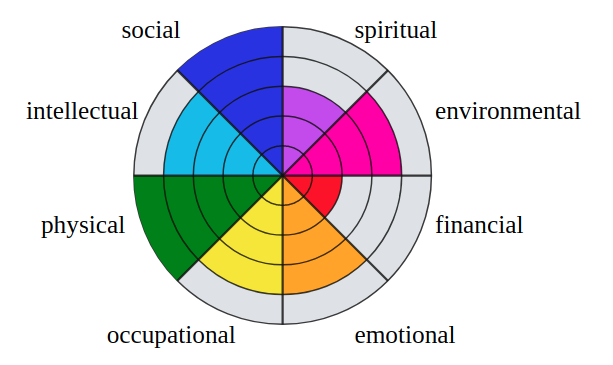
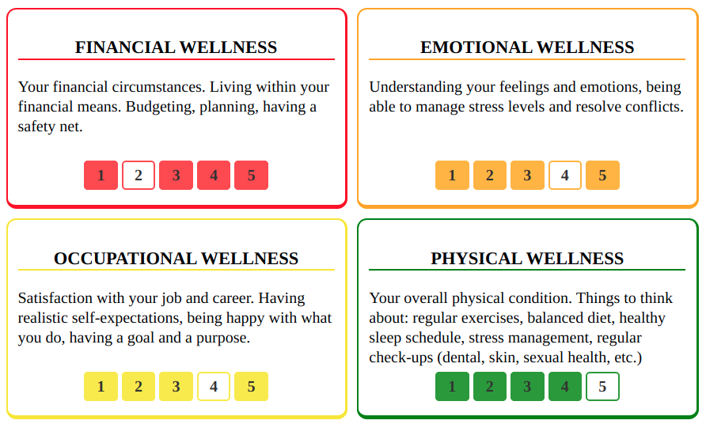
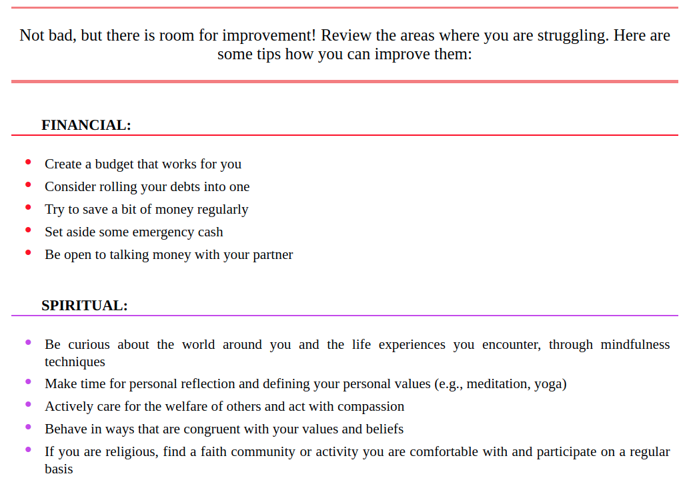

# Wellness Wheel

## **Purpose**

Wellness is a complex state of overall well-being, consisting of 8 dimensions. 

The Wellness Wheel application was created to visualize user's wellness and its dimensions, which is vital for understanding, tracking and optimizing one's well-being.

## **Using the app**

Users are required to select one option for every wellness dimension. After hitting "Submit", the user is able to see their wellness wheel, every sector of which corresponds to a wellness dimension and has a radius length corresponding to the option selected.

Tips on how to improve are printed out for dimensions where the user selected 3 or less.

## **Links**
The app URL: [https://wellness-wheel.stackblitz.io](https://wellness-wheel.stackblitz.io)

You can play with the code [here](https://stackblitz.com/edit/wellness-wheel?)

## Getting started with the cloned app
In the terminal, run the following commands:

  - To install dependencies  `yarn install`
  - To start the app  `yarn start`

